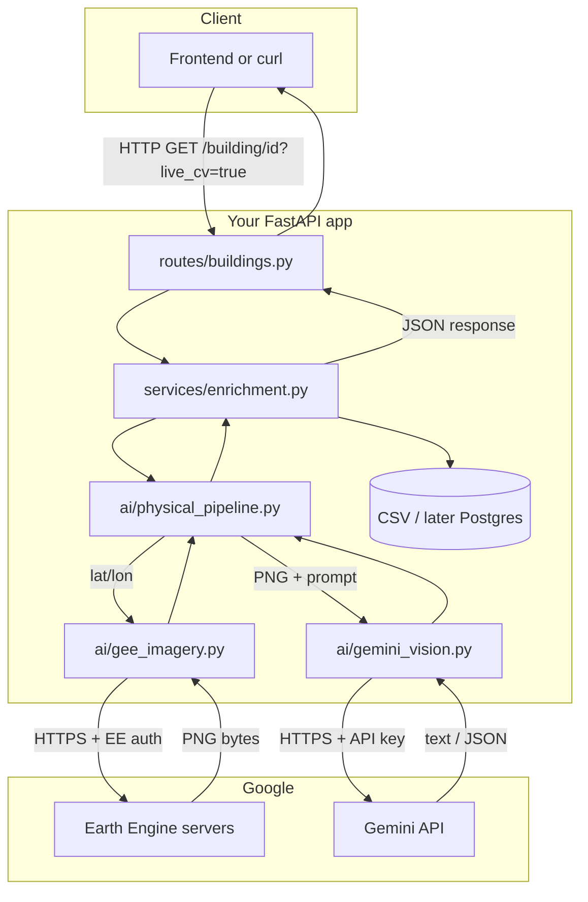

# APIs, Earth Engine, Gemini — how it fits together

This doc explains **your FastAPI app**, **Google Earth Engine (EE)**, and **Gemini**, how data moves between them, and what **`scripts/smoke_test.py`** is for. For more detail on vision-only behavior, see [VISION_PIPELINE.md](./VISION_PIPELINE.md).

---

## 1. The three “systems”

| System | Role | “Secret” or login |
|--------|------|-------------------|
| **RainUSE Nexus API** (FastAPI) | Your backend. The frontend (or `curl`) talks **only** to this. | No key for itself; runs on your laptop or a server. |
| **Google Earth Engine** | Builds a **small satellite image** (PNG) around a building’s lat/lon. | **`GEE_PROJECT_ID`** + **`earthengine authenticate`** (or a service account). **No** Gemini-style API key in `.env`. |
| **Gemini API** (Google AI) | Looks at that **PNG** + your text prompt; returns text (you parse JSON). | **`GEMINI_API_KEY`** (+ optional **`GEMINI_MODEL`**) in `.env`. |

Important: **Earth Engine and Gemini do not talk to each other directly.** Your Python code is the glue: **EE → bytes → Gemini**.

---

## 2. Big picture flow



---

## 3. Example: one request end-to-end

**Request (from browser or Postman):**

```http
GET http://127.0.0.1:8000/building/tx-dfw-001?live_cv=true
```

**Assumptions:** `ENABLE_LIVE_CV=true` in `.env`, EE registered, `earthengine authenticate` done, `GEMINI_API_KEY` set, building has `latitude` / `longitude` in the dataset.

| Step | What happens |
|------|----------------|
| **1** | FastAPI **`routes/buildings.py`** loads the building row **`tx-dfw-001`** from **`database/db.py`** (CSV today). |
| **2** | **`enrich_building(..., live_cv=true)`** runs. It loads state rainfall + water price for **TX**. |
| **3** | **`get_physical_analysis(record, force_live=True)`** runs in **`ai/physical_pipeline.py`**. |
| **4** | **`fetch_sentinel2_thumb_png(lat, lon)`** in **`ai/gee_imagery.py`** calls **`ee.Initialize(project=GEE_PROJECT_ID)`** (first time), builds a **Sentinel-2** median composite, and gets a **thumbnail URL** from Earth Engine. |
| **5** | **`httpx`** downloads that URL → **`png_bytes`** in memory. |
| **6** | **`analyze_cooling_tower_from_image(png_bytes)`** in **`ai/gemini_vision.py`** opens **`google.genai.Client(api_key=GEMINI_API_KEY)`**, sends **text prompt + image**, and reads **`response.text`**. |
| **7** | Your code **parses JSON** from that text → `cooling_tower_likely`, `confidence`. |
| **8** | **`PhysicalAnalysis`** is filled: `imagery_source=COPERNICUS/S2_SR_HARMONIZED`, `vision_backend=gemini_vision` (or `mock` if step 6 failed). |
| **9** | **Rainwater / savings / viability** use **`roof_catchment_sqft`** (from catalog) + tower fields. |
| **10** | JSON goes back to the client with **`physical_analysis`**, scores, etc. |

**If `live_cv` is false or `ENABLE_LIVE_CV` is false:** steps 4–7 are skipped; you get **mock** tower + `imagery_source: none` (fast, no Google calls).

---

## 4. What each external call is “saying”

### Earth Engine (inside `gee_imagery.py`)

- **Not** a REST call you write by hand; the **`earthengine-api`** Python library talks to Google using your **project + OAuth token** (from `earthengine authenticate`).
- Conceptually: “For this point on Earth, give me a small RGB image from Sentinel-2 for my composite.”

### Gemini (inside `gemini_vision.py`)

- **HTTPS** request to Google’s **Gemini API**, authenticated with **`GEMINI_API_KEY`**.
- Conceptually: “Here is a PNG and a question; reply with **only** this JSON shape …”

---

## 5. Environment variables (reminder)

| Variable | Used by |
|----------|---------|
| `GEE_PROJECT_ID` | Earth Engine `ee.Initialize` |
| `GEMINI_API_KEY` | `google.genai.Client` |
| `GEMINI_MODEL` | Which Gemini model name to call |
| `ENABLE_LIVE_CV` | Must be `true` to allow the live path when `?live_cv=true` |
| `GOOGLE_APPLICATION_CREDENTIALS` | Optional; service account JSON path for EE (if you use that instead of user auth) |

See **`backend/.env.example`**.

---

## 6. What `scripts/smoke_test.py` is

**Smoke test** = a **quick automated check** that the app “basically works” after you change code or dependencies. It is **not** a full product test suite.

**How it runs:** it uses FastAPI’s **`TestClient`**. That starts your **`main:app` inside the same Python process** — you do **not** need to run `uvicorn` separately.

**What it checks:**

1. **`GET /health`** → 200  
2. **`GET /buildings?state=TX`** → 200, JSON has expected fields, first building uses **mock** vision (`vision_backend == mock`)  
3. **`GET /building/{id}`** → 200  
4. **`GET /top-prospects?state=TX&limit=3`** → 200, scores sorted descending  
5. **Only if** you set **`RUN_LIVE_CV=1`** in the environment: **`GET /building/{id}?live_cv=true`** → 200, prints `imagery_source` and `vision_backend` (here EE + Gemini actually run — **slow**, needs network + credentials)

**How to run:**

```bash
cd backend
python scripts/smoke_test.py
RUN_LIVE_CV=1 python scripts/smoke_test.py   # optional, exercises GEE + Gemini
```

If any assertion fails, the script exits with an error so you know something broke.

---

## 7. Related docs

- **[VISION_PIPELINE.md](./VISION_PIPELINE.md)** — mock vs live, caching, troubleshooting.  
- **OpenAPI UI** — run `uvicorn` and open `http://127.0.0.1:8000/docs` to try endpoints interactively.
