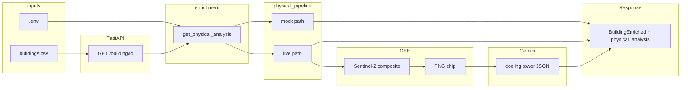

# RainUSE Nexus — Physical / CV / satellite pipeline

This document explains how the backend combines **building catalog data**, **Google Earth Engine (GEE)**, and **Gemini** to satisfy the hackathon “physical targets + confidence” story.

**See also:**

- [API_AND_EXTERNAL_SERVICES.md](./API_AND_EXTERNAL_SERVICES.md) — REST API vs EE vs Gemini, a full request example, and what **`smoke_test.py`** does.
- [CV_IMPLEMENTATION_SUMMARY.md](./CV_IMPLEMENTATION_SUMMARY.md) — **handoff summary**: file-by-file CV story, what you built vs what is not done yet.

## 1. What the rubric asks for

- **Roof catchment area** and a flag for **> 100,000 sq ft**
- **Large cooling tower** presence (or proxy)
- **Confidence scores** for those signals
- Use of **satellite data** (e.g. Sentinel-2 via GEE)

## 2. How this codebase implements it (two layers)

| Layer | Source | What you get |
|--------|--------|----------------|
| **Catalog** | `data/buildings.csv` (later Postgres) | `roof_area_sqft`, `latitude`, `longitude`. Treated as **Open Buildings–style** footprint / catchment for the MVP. |
| **Satellite + vision** | GEE → RGB chip; Gemini → interpretation | Cooling-tower **likelihood** + **confidence**. |

**Important:** Roof **geometry from pure CV segmentation** (drawing a polygon from pixels) is **not** implemented. Catchment area for rainwater math is the **catalog** value. **`roof_confidence`** and **`roof_catchment_provenance`** describe **data lineage** (e.g. Microsoft footprints vs synthetic seed), **not** satellite-derived roof measurement. The satellite path supports **tower detection** and the **GEE → image → model** demo.

**See:** [ROOF_CATCHMENT_LINEAGE.md](./ROOF_CATCHMENT_LINEAGE.md).

## 3. End-to-end flow



1. **`services/enrichment.py`** loads state context and calls **`get_physical_analysis`**.
2. **Rainwater / savings / viability** use **`physical.roof_catchment_sqft`** and **`physical.cooling_tower_*`**.

## 4. Mock vs live

### Mock (default)

Used when:

- `GET /buildings` or `GET /top-prospects`, or
- `GET /building/{id}` **without** `live_cv=true`, or
- `ENABLE_LIVE_CV` is not `true`, or
- Live pipeline fails and code **falls back**

**Outputs:**

- `roof_catchment_sqft` = CSV `roof_area_sqft`
- `large_roof` = catchment ≥ 100,000 sq ft
- `roof_confidence` ≈ **0.72** (catalog trust placeholder)
- `cooling_tower_*` = **deterministic mock** from hashing `building_id`
- `imagery_source` = `none`
- `vision_backend` = `mock`

### Live

Requires **all** of:

1. `.env`: `ENABLE_LIVE_CV=true`
2. `.env`: `GEE_PROJECT_ID` set; Earth Engine **authenticated** on the machine (see §6)
3. `.env`: `GEMINI_API_KEY` for tower vision
4. Request: `GET /building/{id}?live_cv=true`
5. Row has **non-null** `latitude` and `longitude`

**Steps:**

1. **`ai/gee_imagery.py`** — `ee.Initialize(project=GEE_PROJECT_ID)`, build **COPERNICUS/S2_SR_HARMONIZED** median composite (cloud-filtered), clip to a **buffer** around the point (`gee_buffer_meters`, default 180 m), export **RGB thumb** (`gee_thumb_size`, default 512 px).
2. **`ai/gemini_vision.py`** — sends PNG + prompt; parses JSON with `cooling_tower_likely` and `confidence`.
3. **`ai/physical_pipeline.py`** — merges results; **caches** per `building_id` in memory for the process.

If GEE or Gemini fails, behavior **degrades** toward mock (see logs).

## 5. Environment variables

Loaded from **`backend/.env`** (see `.env.example`). Pydantic field names map to env vars like `ENABLE_LIVE_CV`, `GEE_PROJECT_ID`, etc.

| Variable | Purpose |
|----------|---------|
| `ENABLE_LIVE_CV` | `true` to allow live GEE+Gemini when `?live_cv=true`. |
| `GEE_PROJECT_ID` | GCP project ID for `ee.Initialize(project=...)`. |
| `GEMINI_API_KEY` | Google AI Studio API key. |
| `GEMINI_MODEL` | Optional; default in code is `gemini-2.0-flash`. |
| `GOOGLE_APPLICATION_CREDENTIALS` | Optional path to service account JSON (if not using `earthengine authenticate` alone). |

**Never commit `.env`** (repo `.gitignore` includes `backend/.env`).

## 6. Earth Engine authentication

Earth Engine does **not** use a second “API key” string like Gemini for the Python client. You need **project id + auth**:

- **Local dev (simplest):** install `earthengine-api`, run `earthengine authenticate`, complete browser login. Set `GEE_PROJECT_ID` in `.env`.
- **Service account:** create JSON key in GCP, set `GOOGLE_APPLICATION_CREDENTIALS`, and follow current Google docs for **Earth Engine + service accounts** (registration rules apply).

Official access guide: [Earth Engine — Access](https://developers.google.com/earth-engine/guides/access).

## 7. API usage

| Endpoint | Physical pipeline |
|----------|-------------------|
| `GET /buildings?state=TX` | Always **mock** (fast lists). |
| `GET /top-prospects?state=TX` | Always **mock**. |
| `GET /building/{id}` | **Mock** unless `live_cv=true`. |
| `GET /building/{id}?live_cv=true` | **Live** if `ENABLE_LIVE_CV=true` and credentials OK. |

**Frontend tip:** call `live_cv=true` only on **building detail** (or a single demo id). Do not fan it out for every row on a map table.

## 8. File map

| Path | Role |
|------|------|
| `services/settings.py` | Env-driven settings (`get_settings()`). |
| `ai/gee_imagery.py` | Sentinel-2 chip download via GEE + httpx. |
| `ai/gemini_vision.py` | Gemini multimodal + JSON parse. |
| `ai/physical_pipeline.py` | Mock/live selection, cache, fallbacks. |
| `ai/cooling_tower_detection.py` | Legacy mock helper; prefer `physical_pipeline`. |
| `services/enrichment.py` | Wires physical analysis into rainwater, ROI, viability. |
| `models/building.py` | `PhysicalAnalysis`, `BuildingRecord` lat/lon, `BuildingEnriched`. |
| `database/db.py` | Loads CSV including `latitude` / `longitude`. |
| `routes/buildings.py` | `live_cv` query param on single-building route. |

## 9. Texas-first (project strategy)

The code does not hard-code Texas. **Texas-first** means you **prioritize** TX rows for demos, manual QA, and `live_cv` trials—fewer edge cases while you tune prompts and chip size. Expand to other states by adding rows with valid coordinates.

## 10. Limits (for judges / Q&A)

- **Sentinel-2** ~10 m resolution: small towers are hard; treat confidence as **model + image quality**, not survey-grade.
- **Roof area** from full **CV segmentation** is a future step; today the **catalog** is the catchment used in formulas.
- **Gemini** output can be wrong; the API returns whatever was parsed from the model response (clamped to 0–1 for tower confidence).

## 11. Testing

### Automated smoke test (no server)

From the `backend` folder, with your venv activated and dependencies installed:

```bash
cd backend
python scripts/smoke_test.py
```

This hits `/health`, `/buildings?state=TX`, `/building/{id}`, and `/top-prospects` using FastAPI’s `TestClient` (in-process). It expects **mock** vision on list/detail when `live_cv` is not used.

### Live GEE + Gemini (slow)

1. Fill `backend/.env`: `ENABLE_LIVE_CV=true`, `GEE_PROJECT_ID`, `GEMINI_API_KEY`, and complete Earth Engine auth (see §6).
2. **Restart Uvicorn** after changing `.env` so `get_settings()` picks up new values.
3. Run:

```bash
cd backend
RUN_LIVE_CV=1 python scripts/smoke_test.py
```

The first live call per building can take **30–90+ seconds**. Check printed `imagery_source` and `vision_backend` in the output.

### Manual checks with a running server

```bash
cd backend
uvicorn main:app --reload --port 8000
```

Then in a browser or with curl:

- [http://127.0.0.1:8000/docs](http://127.0.0.1:8000/docs) — try **GET /health**, **GET /buildings**, **GET /building/{id}**
- Live: `http://127.0.0.1:8000/building/tx-dfw-001?live_cv=true` (only with `ENABLE_LIVE_CV=true` and credentials)

### After changing `.env` or CSV data

- **Restart** the Uvicorn process (settings and building cache are process-scoped).
- If live CV returned a **bad cached** result, restart clears the in-memory physical-analysis cache.

## 12. Quick troubleshooting

| Symptom | Check |
|---------|--------|
| Always `vision_backend: mock` | `ENABLE_LIVE_CV`, `?live_cv=true`, lat/lon on row. |
| `imagery_source: none` on live call | `GEE_PROJECT_ID`, EE auth, API enabled, network. |
| Tower mock but you expected Gemini | `GEMINI_API_KEY`, model name, quota, response parse errors (logs). |
| `ee.Initialize` errors | Project ID, EE access for account/SA, Google’s current EE onboarding. |
